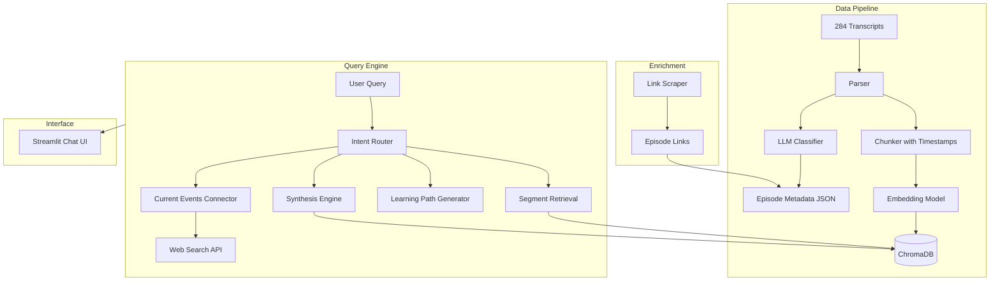

# Lenny's Podcast Intelligence Engine


## Overview

Build an LLM-powered podcast recommendation and intelligence engine over 284 Lenny's Podcast transcripts that provides segment-level search, multi-episode synthesis, learning paths, and current events context.

## Architecture Overview



## Project Structure

```
lenny-podcast/
├── data/
│   ├── transcripts/              # Raw .txt files (existing)
│   ├── processed/
│   │   ├── episodes_metadata.json    # Classifications per episode
│   │   ├── chunks/                   # Chunked transcripts with timestamps
│   │   └── episode_links.json        # YouTube/Spotify/Apple links
│   └── chroma_db/                # Vector database
├── notebooks/
│   ├── 01_parse_and_classify.ipynb
│   ├── 02_chunk_and_embed.ipynb
│   ├── 03_scrape_links.ipynb
│   └── 04_test_retrieval.ipynb
├── src/
│   ├── parser.py                 # Transcript parsing utilities
│   ├── classifier.py             # LLM classification logic
│   ├── chunker.py                # Chunking with timestamp extraction
│   ├── embedder.py               # Embedding pipeline
│   ├── retriever.py              # Segment retrieval logic
│   ├── synthesizer.py            # Multi-episode synthesis
│   ├── learning_paths.py         # Curriculum generator
│   ├── current_events.py         # Web search integration
│   └── config.py                 # API keys, model settings
├── app.py                        # Streamlit application
└── requirements.txt
```

---

## Phases

### Phase 1: Data Parsing and Classification

**Goal**: Parse all 284 transcripts and classify each episode on multiple dimensions.

**Steps**:
1. Create parser to extract guest name from filename and clean transcript text
2. Design classification schema:
   - `topics`: list of 3-5 main topics (e.g., "growth", "hiring", "AI")
   - `guest_role`: founder / PM / designer / VC / exec / researcher
   - `company_stage`: early-stage / growth / public / FAANG
   - `tactical_score`: 1-10 (tactical how-to vs philosophical)
   - `contrarian_score`: 1-10 (conventional vs contrarian views)
   - `key_quotes`: 3-5 notable quotes with approximate positions
   - `one_line_summary`: What this episode is about
3. Use Llama 3.1 8B (via Ollama) with structured output to classify each episode
4. Store as `episodes_metadata.json`

**Output**: JSON file with metadata for all 284 episodes

---

### Phase 2: Chunking and Embedding

**Goal**: Create searchable chunks with timestamps for segment-level retrieval.

**Steps**:
1. Parse timestamps from transcript format (e.g., `(00:15:32)` patterns)
2. Chunk each transcript into ~500 token segments, preserving:
   - Start/end timestamps
   - Speaker attribution
   - Episode reference
3. Generate embeddings using `nomic-embed-text` (via Ollama)
4. Store in ChromaDB with metadata (episode, guest, timestamps, topics)

**Chunking Strategy**:
- Respect speaker boundaries where possible
- Overlap chunks by ~50 tokens for context continuity
- Store chunk index for ordering

**Output**: ChromaDB with ~15,000-20,000 embedded chunks

---

### Phase 3: Episode Link Scraping

**Goal**: Get playable links for each episode.

**Steps**:
1. Scrape lennyspodcast.com for canonical episode URLs
2. Use YouTube Data API to find corresponding videos
3. Match episodes by guest name + fuzzy title matching
4. Store as `episode_links.json` with structure:
   ```json
   {
     "Brian Chesky": {
       "youtube": "https://...",
       "spotify": "https://...",
       "website": "https://..."
     }
   }
   ```

**Output**: Link mappings for all episodes

---

### Phase 4: Retrieval and Synthesis Engine

**Goal**: Build the core query engine with multiple modes.

**Components**:

#### 4.1 Segment Retrieval
- Query embedding + similarity search in ChromaDB
- Return top-k chunks with timestamps
- Re-rank by relevance using cross-encoder (optional)

#### 4.2 Multi-Episode Synthesis
- Retrieve relevant chunks from multiple episodes
- Group by episode/guest
- LLM generates synthesized answer with inline citations
- Format: "Guest says '...' [Episode, timestamp]"

#### 4.3 Intent Router
- Classify user query intent:
  - `recommendation`: "What should I listen to?"
  - `question`: "What do guests say about X?"
  - `learning_path`: "I'm a new PM..."
  - `current`: "What's relevant given recent news?"

**Output**: Python modules for each retrieval mode

---

### Phase 5: Learning Path Generator

**Goal**: Generate curated episode sequences based on user context.

**Steps**:
1. Extract user context (role, experience, challenge)
2. Query for relevant episodes across difficulty/depth spectrum
3. Order episodes pedagogically (foundational → advanced → contrarian)
4. LLM generates rationale for each episode in path

**Output Format**:
```
Learning Path: "Becoming a Growth PM"
1. Elena Verna - Growth fundamentals [32 min segment]
2. Casey Winters - Growth vs product [full episode]
3. Brian Balfour - Contrarian take on...
```

---

### Phase 6: Current Events Integration

**Goal**: Connect recommendations to what's happening now.

**Steps**:
1. Integrate DuckDuckGo search (no API key required) via `duckduckgo-search` package
2. When query is vague or time-sensitive:
   - Fetch recent news in relevant domain
   - Match news topics to episode topics
   - Surface "why this matters now" context
3. Optional: Cache recent searches to avoid redundant API calls

---

### Phase 7: Streamlit Interface

**Goal**: Build an interactive chat UI.

**Features**:
- Chat input with conversation history
- Mode selector: Quick Answer / Learning Path / What's Hot
- Response display with:
  - Synthesized answer
  - Source segments with timestamps
  - Clickable episode links (YouTube/Spotify)
  - Learning path cards (if applicable)
- Sidebar: Browse by topic, guest, or classification

---

## Tech Stack (Fully Open Source / Local)

| Component | Tool | Why |
|-----------|------|-----|
| LLM | Llama 3.1 8B via Ollama | Best open source model, runs locally |
| Embeddings | nomic-embed-text via Ollama | Top open source embeddings, local |
| Vector DB | ChromaDB | Local, simple, good for prototyping |
| Web Search | DuckDuckGo (duckduckgo-search) | Free, no API key required |
| Frontend | Streamlit | Fast to build, good for demos |
| Scraping | BeautifulSoup + requests | Simple and sufficient |

---

## Dependencies

```
ollama
chromadb
streamlit
beautifulsoup4
requests
duckduckgo-search
python-dotenv
tqdm
```

---

## Ollama Setup (Required)

```bash
# Install Ollama
brew install ollama  # Mac
# or: curl -fsSL https://ollama.com/install.sh | sh  # Linux

# Pull required models
ollama pull llama3.1:8b
ollama pull nomic-embed-text

# Start Ollama server (runs in background)
ollama serve
```

### Hardware Requirements
- RAM: 16GB minimum, 32GB recommended
- GPU: Optional but speeds up inference significantly
- Disk: ~5GB for models

---

## Estimated Timeline

| Phase | Effort | Output |
|-------|--------|--------|
| Phase 1 | 2-3 hours | 284 classified episodes |
| Phase 2 | 2-3 hours | ChromaDB with chunks |
| Phase 3 | 1-2 hours | Episode links |
| Phase 4 | 3-4 hours | Retrieval + synthesis |
| Phase 5 | 2 hours | Learning paths |
| Phase 6 | 1-2 hours | Current events |
| Phase 7 | 2-3 hours | Streamlit UI |
| **Total** | **~15-20 hours** | Working demo |

---

## TODO

- [ ] Phase 1: Parse all 284 transcripts and classify with LLM
- [ ] Phase 2: Chunk transcripts with timestamps and embed into ChromaDB
- [ ] Phase 3: Scrape episode links from YouTube/Spotify/lennyspodcast.com
- [ ] Phase 4: Build segment retrieval and multi-episode synthesis engine
- [ ] Phase 5: Implement learning path generator based on user context
- [ ] Phase 6: Integrate DuckDuckGo for current events context
- [ ] Phase 7: Build Streamlit chat interface with all features

